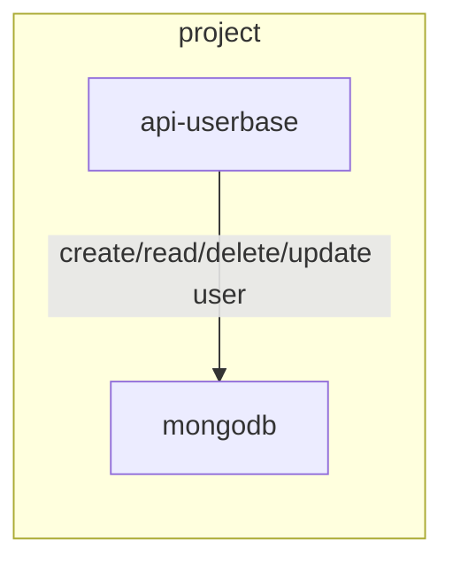

# api-userbase

this project is a sandbox to explore how to create an API using Golang which discuss with an API, 
and provides unit tests

## architecture

```mermaid
flowchart LR
    subgraph project
        api-userbase --> |create/read/delete/update user| mongodb
        mongodb
    end

```
